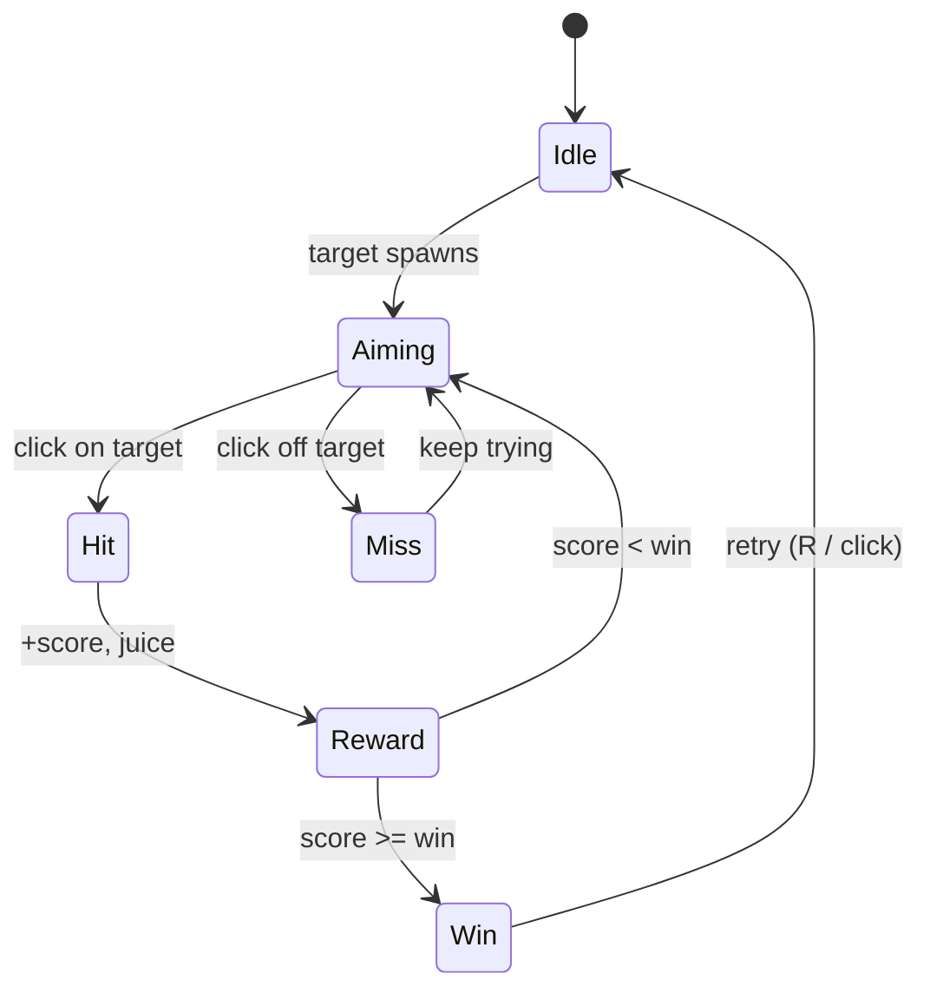

# Core Loop — ebby-title-01

## Frame budget

- Input → visual feedback: **≤ 80 ms**
- Target spawn animation: **120 ms** (in/out)
- Hit feedback (shake + sound): **200 ms** total

If any of these slip, perf debt is logged in `happy-accidents.md` as a "feel bug".

## States and transitions

| From | Event | To | Side effect |
|------|-------|----|-------------|
| Idle | _ready | Aiming | spawn target |
| Aiming | left-click on target | Hit | score += 1 |
| Aiming | left-click off target | Aiming | (later: combo break) |
| Hit | always | Reward | play juice |
| Reward | score < win | Aiming | reposition target |
| Reward | score >= win | Win | show "You win!" |
| Win | R or left-click | Idle | reset score |

## Telemetry we want once it's running

- `loop.start` — page load → first target visible
- `loop.hit` — score, position, time since spawn
- `loop.miss` — position
- `loop.win` — total elapsed
- `loop.quit` — close tab / press escape

Telemetry is **week 2+**. Don't gold-plate the loop before it's fun.
